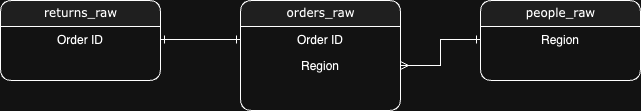
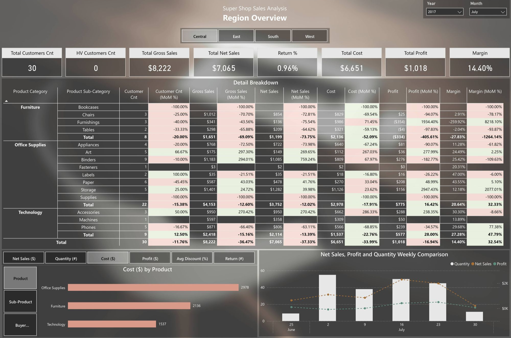

# BI end-to-end Development - Sales Overview

## Table of Content
+ [Description](#Description)
+ [Task (Business Questions Asked)](#task-business-questions-asked)
+ [Tech Stack](#tech-stack)
+ [Deliverables](#deliverables)
    + [Data Models](./dbt/models/)
    + [Business Question Answered](#business-question-answered)
    + [PowerBI Data Visualization](#data-visualization)

<br>


## Description
There is an e-commerce company that sells different product to customer within the US. 

<br>

## Task (Business Questions Asked)
1. We're interested in customers who are spending quite a lot with individual orders. Can you tell us how many customers there are which have placed at least one order in which their total sales amount exceeded $2,000?

2. We're a bit worried about the increasing number of returns. Can you look into the data on returns and see whether you can find any valuable information on these returns, e.g., in the context of product category, time?

3. You are having a meeting with one of the regional managers. Can you prepare a dashboard which allows you to evaluate key performance indicators (KPI) of the region? 
    + The manager didn't provide you with any requirements and expects to take the first shot. 

<br>

## Tech Stack


*PostregreSQL is for development. PowerBI dashboard connected via BigQuery.*

<br>

## Database Schema


<br>

## Deliverables

### Business Question Answered

<code> **Can you tell us how many customers there are which have placed at least one order in which their total sales amount exceeded $2,000?** </code>

```sql
SELECT
COUNT(DISTINCT customer_id) AS hv_customer_cnt
FROM dbt_prod.pd_super_shop_sales
WHERE quantity >= 1
AND net_sales >= 2000
AND is_returned = FALSE

-- OR

SELECT
COUNT(DISTINCT customer_id) AS hv_customer_cnt
FROM dbt_prod.pd_super_shop_sales
WHERE is_high_value_sales
```
| hv_customer_cnt |
| ---------------: |
| 97              |


<br>

<code> **Can you look into the data on returns and see whether you can find any valuable information on these returns, e.g., in the context of product category, time?** </code>

```sql
SELECT
product_category,
COUNT(DISTINCT order_id) AS return_cnt
FROM dbt_prod.pd_super_shop_sales
WHERE is_returned
GROUP BY
      product_category
ORDER BY
	return_cnt DESC
```
| product_category | return_cnt |
| ---------------- | ----------: |
| Office Supplies  | 234        |
| Furniture        | 136        |
| Technology       | 123        |

<br>

### Data Visualization
#### 🖼️ Dashboard Snapshot in Power BI


<br>

#### 📺 Quick PowerBI Dashboard Demo
[](https://www.youtube.com/watch?v=2MCzeJqLZJE)
